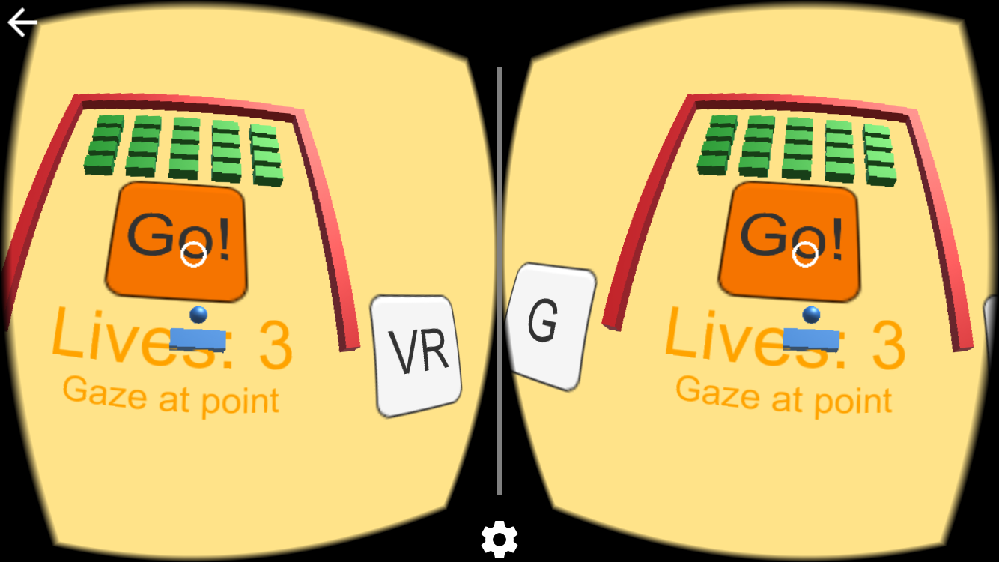

# Breakout-VR
A Breakout game in Unity 5, then converted to add a VR mode for Google Cardboard.

Used as a way to test various input types with the Cardboard, including:
* Gamepad/Keyboard support
* Head Rotation - Turn your head left/right and the paddle will move in that direction until you turn your head back to the deadzone.
* Head Tilt - Tilt your head left/right and the paddle will move in that direction until you tilt your head back to the deadzone.
* Gaze at Point - Look at a point on the board, (actually an invisible plane,) and the paddle will move until it is level with that point.
* Gaze with Click - Look at a point on the board, (actually an invisible plane,) and hold the button on yourCardboard device to make the paddle move until it is level with that point.

Use the button at the bottom left of the board to switch input modes.

**TODO:**
* Add touch controls, (e.g. AxisTouchButton.cs)
* Make the inputControlPlane wider, based on user testing
* Some additional input methods, which are mostly variations on what is already here, such as:
  * scaling speed of paddle by distance away from your gaze point
  * locking paddle to your gaze point
  * look at a point and click to designate a point for the paddle to move to

Base version initially based on this tutorial from the Unity website:
http://unity3d.com/learn/tutorials/modules/beginner/live-training-archive/creating-a-breakout-game?playlist=17219

VR version follows similar steps to my Roll-a-Ball VR tutorial:
http://blog.hiash.com/2016/02/vr-for-beginners-cardboard-unity-and.html
